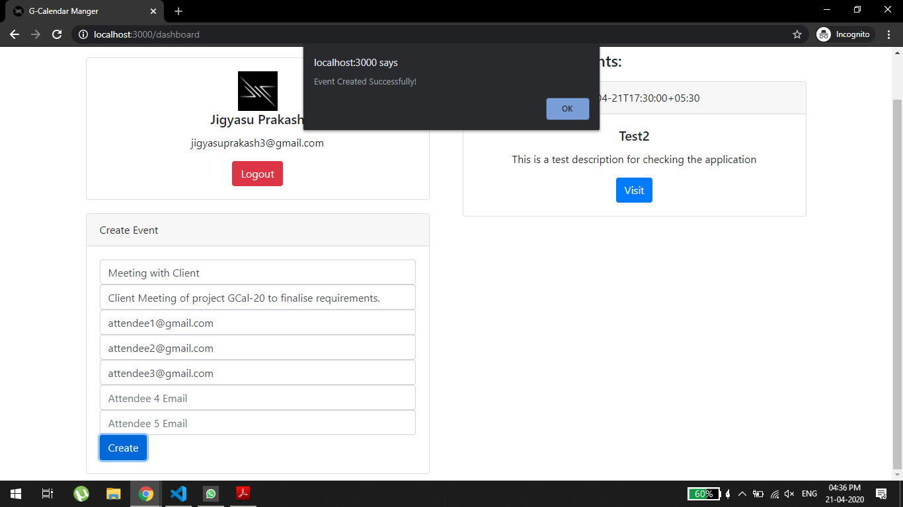

# G-Calendar Manager

    
  

A simple to use google calendar manager built using Google Calendar API.

### Aim
To integrate google calendar using NodeJS as backend and following feature should be implemented.

- User should be able to authenticate with the system with the users gmail account.
- Build a web server to read users upcoming events and give the events in a json.
- Build a web service to send an event.
  - It should accept email id's as input
  - Body of the meeting.
  - Title of the meeting.

### Approach
- Create a [express] web application which handles users request and responses.
- [Google API] for getting access of users google calendar.

### Features
- Very simple and light weight UI.
- Easy to create google calendar events and share with friends and colleages (at max 5).

### How to use
1. Click on "Login with Google" to authenticate your google account with the application

2. Enter your google credentials and continue

3. Allow permissions to let G-Calendar Manager access your google calendar

4. There you go, you reached to dashboard

5. Now lets create an event and share with 2 friends, complete the details and click "Create"

6. An alert is shows which shows the event is successfully created.

7. The updated events is fetched again and the newly created event is visible on the dashboard

### Teach Stack
- Frontend
  - HTML
  - Bootstrap
  - JQuery
- Backend
  - Javascript
  - Express JS
  - Node JS
- External API
  - Google Calendar API v3

### Version
| Tag    | Date           | Description   |
|--------|----------------|---------------|
| [v1.0] | 21 April, 2020 | First Release |

### Developer
- [Jigyasu Prakash]

[v1.0]: <https://github.com/JigyasuPrakash/g-calendar-manager/tree/1379f6374e27e09336c483018f903a6ae599d843>
[express]: <https://expressjs.com/>
[Google Api]: <https://developers.google.com/apis-explorer>
[Jigyasu Prakash]: <https://itsjigyasu.me/>
